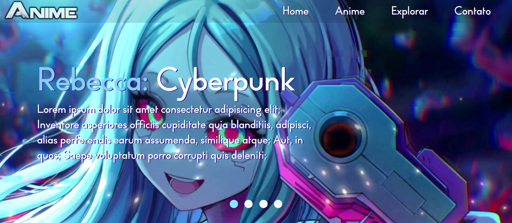

<h1 align="center"> Slide-show com Javascript </h1>

<h2 align="center">Um slide-show simples feito com Javascript</h2>

<h2> ➢ O que é esse projeto? </h2>

 
  Este projeto foi feito com o objetivo de estudar a manipulação de elementos HTML com
  o DOM (Document Object Model) do JavaScript. Desta vez eu fiz uma página simples com
  um slide-show de personagens de animes famosos.

  Você pode acessar o site clicando neste link: https://slider-js-ten.vercel.app/

<h3> ➢ Outras informações </h3>
<ul>
  <li> <strong>Status:</strong> <em>Desenvolvendo</em>
  <li> <strong>Linguagens utilizadas:</strong>  
    

             
        
      
    

  <li> <strong>Conhecimentos aplicados:</strong>
  <ul>
    <li> <em>JavaScript DOM</em>
  </ul>
</ul>

 Baseado em: https://gabriel-damas.github.io/Slide.Anime/

